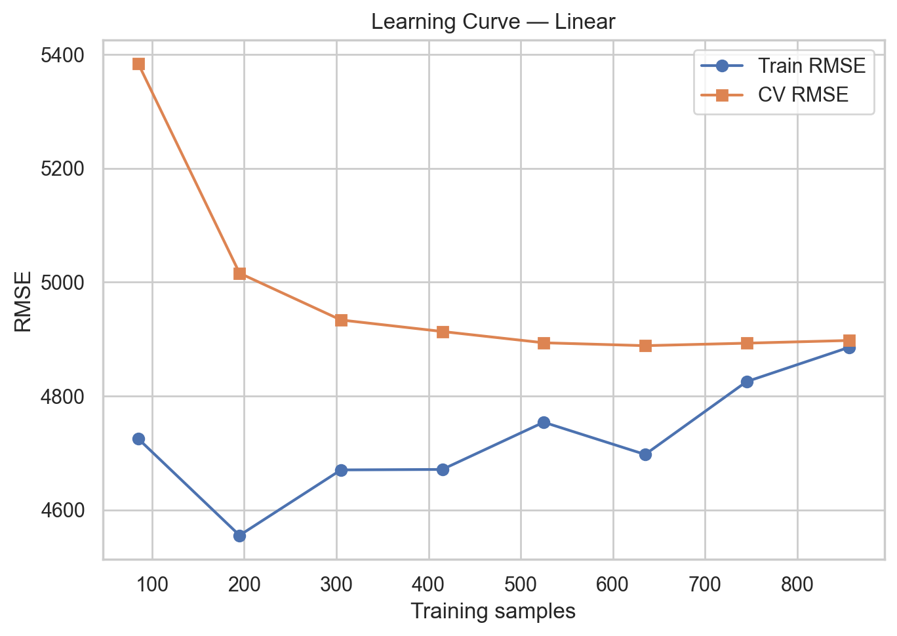

# Medical Cost Prediction — Linear & Regularized Regression (scikit-learn)

> **Notebook stack:** `01_regression_baseline_linear_models.ipynb` → `02_feature_engineering_and_diagnostics.ipynb` → `03_regularization_paths_and_model_selection.ipynb` → `04_model_selection_report_and_export.ipynb`

This repository implements a **clean, reproducible regression pipeline** for the Kaggle “Medical Cost Personal Datasets” (a.k.a. Insurance). The focus is **only** on linear family models:
- Ordinary **Linear Regression**
- **Ridge**, **Lasso**, and **ElasticNet**
- Optional **log-transform** of the target (`charges`) for skew handling

The project includes:
- End‑to‑end preprocessing with `ColumnTransformer` (StandardScaler + OneHotEncoder)
- Domain-driven **feature engineering** (selected interactions like `smoker×age`, `smoker×bmi`, `age×bmi`)
- **Cross-validation** (including **Nested CV** in Notebook 04)
- Robust metrics: **RMSE, MAE, R², MAPE, RMSLE**
- Diagnostics: residual plots, heteroskedasticity/normality checks, **subgroup error audit**
- **Learning curve** for the final model
- **Saved pipeline** (`joblib`) for production-style inference
- Lightweight **Model Card**

---

## 📂 Project Structure

```
.
├── data/
│   └── insurance.csv                # put dataset here
├── models/
│   └── final_<model>_pipeline.joblib   # saved by Notebook 04
├── notebooks/
│   ├── 01_regression_baseline_linear_models.ipynb
│   ├── 02_feature_engineering_and_diagnostics.ipynb
│   ├── 03_regularization_paths_and_model_selection.ipynb
│   └── 04_model_selection_report_and_export.ipynb
├── reports/
│   ├── final_results.csv
│   └── figures/
│       └── learning_curve_<model>.png  # optional save from Notebook 04
├── requirements.txt
├── README.md
└── MODEL_CARD.md
```

> **Dataset:** *Medical Cost Personal Datasets* (Kaggle). Features: `age`, `sex`, `bmi`, `children`, `smoker`, `region`; Target: `charges`.

---

## 📊 Results (Test Set)

| Best Model | RMSE (test) | MAE (test) | R² (test) | MAPE% (test) | RMSLE (test) |
|-----------:|------------:|-----------:|----------:|-------------:|-------------:|
| Linear    |    4567.93 |    2760.61 |    0.866 |       29.37% |      0.3945 |

The final model was selected with **Nested CV** (outer 5-fold). Results show models are statistically very close; we chose **Linear** by Occam’s razor (simplest sufficient model).

### Nested CV summary (lower RMSE is better)
```
Linear      4897.71 ± 576.65
ElasticNet  4898.05 ± 576.98
Ridge       4898.29 ± 577.20
Lasso       4900.63 ± 574.14
```

**Learning curve:** save as `reports/figures/learning_curve_linear.png` from Notebook 04 and link it here if desired.

---

## 🧠 Methodology

**Preprocessing**
- Numeric: `age`, `bmi`, `children` → `StandardScaler`
- Categorical: `sex`, `smoker`, `region` → `OneHotEncoder(drop='first', handle_unknown='ignore')`

**Feature Engineering (02)**
- Interaction terms: `smoker×age`, `smoker×bmi`, `age×bmi`
- (No global PolynomialFeatures to avoid feature explosion/collinearity)

**Models**
- Linear Regression
- Ridge / Lasso / ElasticNet (hyperparameters via CV)
- Optional **log-transform** of target for skew (predictions back-transformed with `expm1`)

**Validation**
- KFold CV (shuffle, fixed seed)
- **Nested CV** for fair generalization estimate (Notebook 04)

**Metrics**
- RMSE, MAE, R², MAPE, RMSLE (reported on the **original target scale**)

**Diagnostics (02)**
- Residual plots (fitted vs residuals; scale–location), Q–Q
- Tests: D’Agostino normality (`scipy.stats.normaltest`), Breusch–Pagan (`het_breuschpagan`)
- **Subgroup errors:** by `smoker`, `sex`, `region`, and `age` bins

---
##  visulization 

learning_curve_liner   


## 🧪 Reproducibility

- Random seed: `42` (CV split & model initializations where applicable)
- Deterministic CV setup (`shuffle=True`)
- `requirements.txt` with pinned/compatible versions

---

## 🔧 Inference (using saved pipeline)

```python
import joblib, pandas as pd

pipe = joblib.load("models/final_linear_pipeline.joblib")

sample = pd.DataFrame([{{  # note: doubled braces to render literal dict
    "age": 40,
    "sex": "female",
    "bmi": 29.5,
    "children": 2,
    "smoker": "no",
    "region": "southeast"
}}])

pred = pipe.predict(sample)
print("Predicted charges:", float(pred))
```

> **Note:** Keep input schema identical to training features (names/types).

---

## ⚖️ Assumptions & Limitations

- Dataset is U.S.-centric; generalization to other populations may be limited.
- Linear family may underfit highly non-linear effects; feature engineering helps but is not exhaustive.
- `charges` distribution is long-tailed; log-transform improves stability but can bias back-transform when evaluating with RMSE.

**Fairness note:** subgroup error tables are reported to surface systematic biases (e.g., smokers vs non-smokers).

---

## 📄 License

MIT

---


